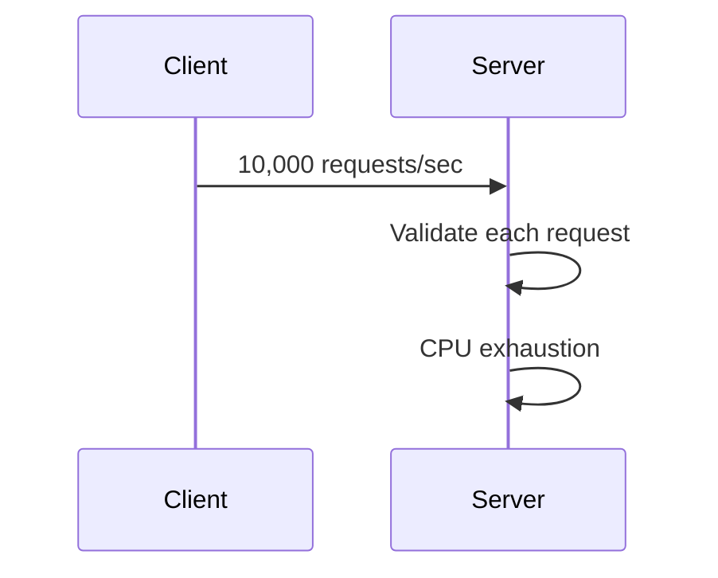
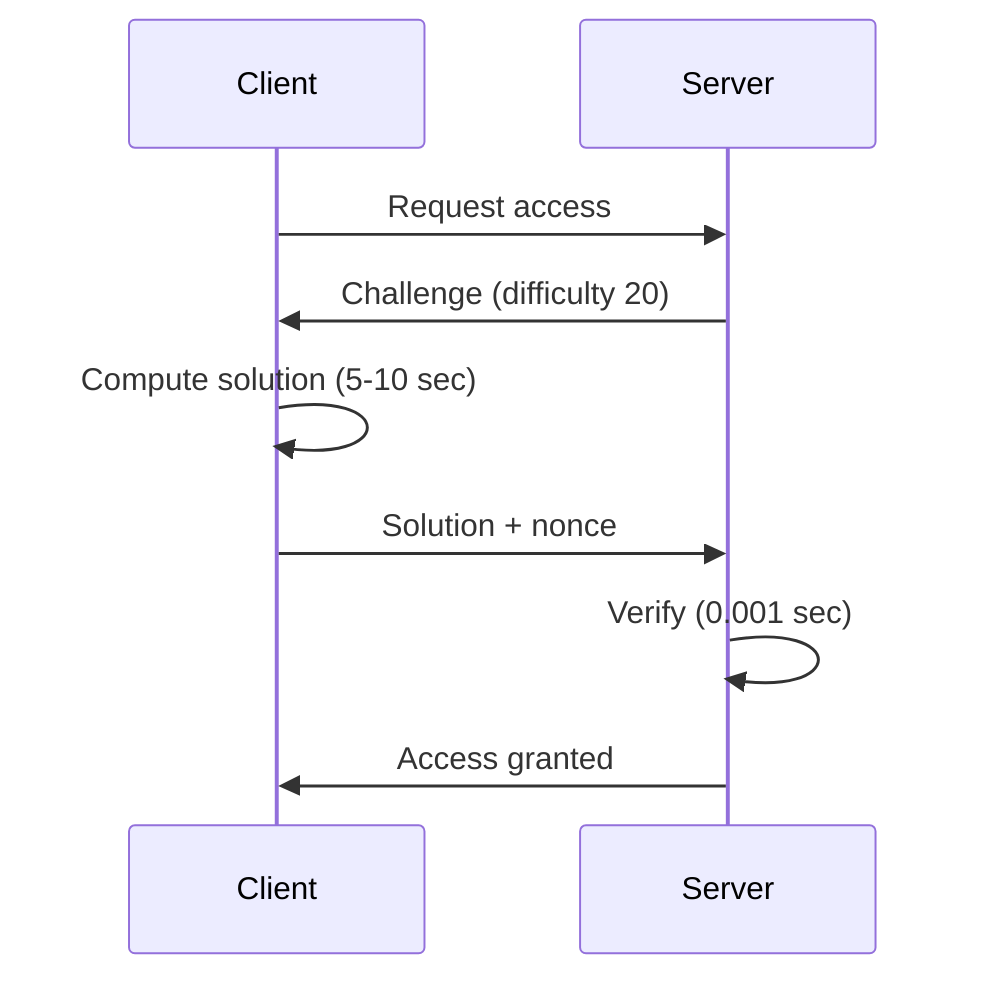
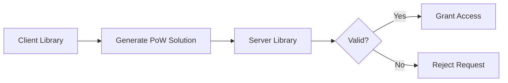

# 🔐 POW - Proof of Work Cryptographic Library

[](https://github.com/QudsLab/POW/actions)
[](https://opensource.org/licenses/MIT)
[](https://github.com/QudsLab/POW)
[](https://github.com/QudsLab/POW)
[](https://github.com/QudsLab/POW/pulls)
[](https://github.com/QudsLab/POW)
[](https://github.com/QudsLab/POW/stargazers)
[](https://github.com/QudsLab/POW)


> **Enterprise-grade, cross-platform C library for Proof of Work (PoW) implementations** — Production-ready cryptographic primitives for DDoS mitigation, spam prevention, and intelligent rate limiting.

---

## 🎯 Why Proof of Work?

In an environment of automated attacks, API exploitation, and distributed denial-of-service threats, **computational proof of work** delivers a **zero-trust, cryptographically verifiable** defense layer:

| Challenge | Conventional Approach | PoW Approach |
|-----------|----------------------|--------------|
| **DDoS Attacks** | Rate limiting (circumventable) | Computational challenge (cryptographically enforced) |
| **Bot Spam** | CAPTCHAs (degrades UX) | Silent computational work (transparent to users) |
| **API Abuse** | API keys (vulnerable to theft) | Per-request challenges (ephemeral validation) |
| **Sybil Attacks** | Account restrictions (creates barriers) | Resource-based throttling (equitable & autonomous) |

### 💡 The Mechanism of PoW

**Conventional Verification (Server-Intensive):**


**PoW Verification (Server-Efficient):**


### 🚀 Core Advantages

- **Asymmetric Computation**: Client performs intensive work (seconds), server validates efficiently (microseconds)
- **Self-Regulating**: Attackers cannot circumvent — increased requests require proportional computational resources
- **Privacy-Preserving**: No user data collection, no persistent tracking mechanisms
- **Equitable Access**: Legitimate users experience minimal friction, malicious actors face significant overhead
- **Stateless Operation**: No session persistence required — validation can be cached per user lifecycle

---

## 🏗️ Architecture

The POW library implements **two complementary components** operating in coordination:



### Client Workflow
```
1. Request challenge from server
2. Receive: challenge_data + difficulty
3. Compute: Determine nonce where hash(challenge + nonce) satisfies difficulty
4. Submit: nonce + solution_hash
```

### Server Workflow
```
1. Generate challenge (cryptographically random data)
2. Transmit to client with difficulty target
3. Receive client's solution
4. Verify: hash(challenge + nonce) == expected_hash ✅
5. Cache verification (configurable: lifetime validity)
```

---

## 📦 Multi-Platform Support

Pre-compiled binaries available for seamless integration:

| Platform | 32-bit | 64-bit | Binary Format |
|----------|--------|--------|---------------|
| 🪟 **Windows** | ✅ | ✅ | `.dll` |
| 🐧 **Linux** | ✅ | ✅ | `.so` |
| 🍎 **macOS** | — | ✅ | `.dylib` |
| 🤖 **Android** | ✅ (ARMv7) | ✅ (ARM64) | `.so` |

### 📥 Download Binaries

**Direct Download** (latest stable release):
```bash
# Example: Windows 64-bit client
curl -LO https://github.com/QudsLab/POW/raw/refs/heads/main/bin/windows/64/client.dll

# Linux 64-bit server
curl -LO https://github.com/QudsLab/POW/raw/refs/heads/main/bin/linux/64/server.so
```

**Browse all binaries**: [📂 /bin directory](https://github.com/QudsLab/POW/tree/main/bin)

**Programmatic Access**:
```bash
# Retrieve versions.json for checksums and URLs
curl https://github.com/QudsLab/POW/raw/refs/heads/main/bin/versions.json
```

**📂 Binary Structure**: Refer to the [/bin directory](https://github.com/QudsLab/POW/tree/main/bin) for complete organization and available binaries.

---

## 🔨 Build Instructions

### Local Compilation

Compile for all supported platforms:

```bash
# Build all targets
make all

# Platform-specific builds
make windows
make linux
make macos
make android
```

### CI/CD Automated Builds

Every commit to `main` triggers automated cross-platform compilation via GitHub Actions:

1. Code changes pushed to repository
2. GitHub Actions orchestrates Windows/Linux/macOS/Android builds
3. Binaries committed to `/bin` directory
4. `versions.json` updated with checksums and download URLs

**Continuous delivery** — binaries remain synchronized with source code.

---

## 🎯 Use Cases

### 1. **API Rate Limiting** (Keyless Authentication)
```
Client requests access → Server issues challenge → Client computes PoW → Access granted for 24h
```

### 2. **DDoS Mitigation** (Autonomous Throttling)
```
Legitimate user: 1 request = 2 seconds computation (acceptable overhead)
Malicious actor: 1000 requests = 2000 seconds computation (economically infeasible)
```

---

## 📊 Performance Benchmarks

| Difficulty | Average Time (Client) | Verification (Server) | Recommended Use Case |
|------------|----------------------|----------------------|---------------------|
| 10 | ~0.5 sec | 0.0001 sec | Minimal protection |
| 15 | ~2 sec | 0.0001 sec | Moderate protection |
| 20 | ~8 sec | 0.0001 sec | Enhanced protection |
| 25 | ~30 sec | 0.0001 sec | Maximum protection |

*Benchmarked on Intel i7-9700K @ 3.6GHz*

---

## 🤝 Contributing

Contributions are welcomed and encouraged:

### For Library Developers
- 🌍 **Language Bindings**: Develop wrappers for Python, Node.js, Go, Rust, etc.
- 🔧 **Performance Optimization**: Enhance hashing algorithms
- 📝 **Documentation**: Expand examples and implementation guides
- 🐛 **Issue Reporting**: Submit reproducible bug reports

### For Users
- ⭐ **Star the repository** if this library proves valuable
- 📢 **Share** with developers requiring PoW solutions
- 💡 **Feature requests** via GitHub Issues

### Development Environment Setup

```bash
# Clone repository
git clone https://github.com/QudsLab/POW.git
cd POW

# Install build dependencies
sudo apt-get install build-essential gcc-multilib

# Build and execute tests
make all
make test

# Submit pull request
git checkout -b feature/your-feature
git commit -m "Add feature implementation"
git push origin feature/your-feature
```

---

## 🌟 Star History

If this library enhanced your project, consider starring the repository! ⭐

[](https://star-history.com/#QudsLab/POW&Date)

---

## 🔗 Resources

- 📚 **Documentation**: [Wiki](https://github.com/QudsLab/POW/wiki)
- 🐛 **Issue Tracker**: [GitHub Issues](https://github.com/QudsLab/POW/issues)
- 💬 **Community Discussions**: [GitHub Discussions](https://github.com/QudsLab/POW/discussions)
- 📦 **Binary Releases**: [/bin directory](https://github.com/QudsLab/POW/tree/main/bin)

---

## 📜 License

This project is licensed under the **MIT License** - refer to the [LICENSE](LICENSE) file for comprehensive details.

---

<div align="center">

**Developed by [QudsLab](https://github.com/QudsLab)**

*Engineering cryptographic security, one hash at a time* 🔐

</div>