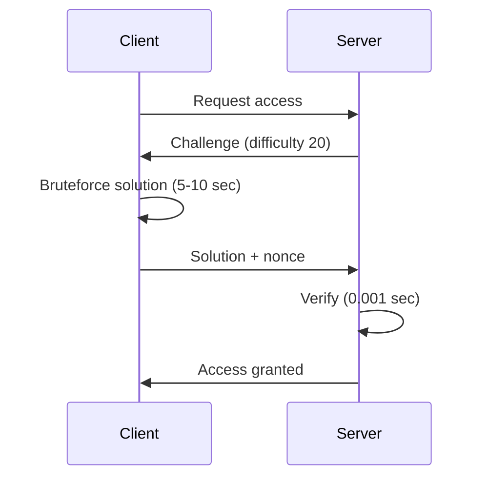
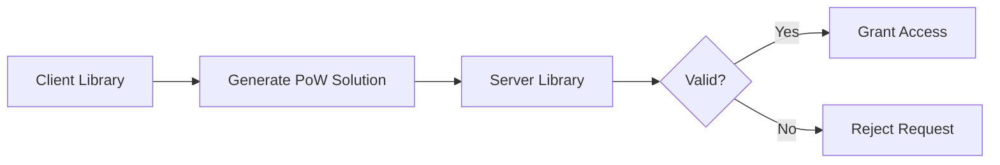

## 🤝 Contributing

We welcome contributions! Here's how you can help:

### For Library Developers
- 🌍 **Language Bindings**: Create wrappers for Python, Node.js, Go, Rust, etc.
- 🔧 **Optimization**: Improve hashing performance
- 📝 **Documentation**: Add examples and tutorials
- 🐛 **Bug Reports**: Open issues with reproducible examples

### For Users
- ⭐ **Star the repo** if you find it useful
- 📢 **Share** with developers who need PoW
- 💡 **Suggest features** via GitHub Issues

### Development Setup

```bash
# Clone repository
git clone https://github.com/QudsLab/POW.git
cd POW

# Install dependencies
sudo apt-get install build-essential gcc-multilib

# Build and test
make all
make test

# Submit PR
git checkout -b feature/your-feature
git commit -m "Add amazing feature"
git push origin feature/your-feature
```

---

## 🌟 Star History

If this library helped your project, consider giving it a star! ⭐

[](https://star-history.com/#QudsLab/POW&Date)

---

## 🔗 Links

- 📚 **Documentation**: [Wiki](https://github.com/QudsLab/POW/wiki)
- 🐛 **Issues**: [GitHub Issues](https://github.com/QudsLab/POW/issues)
- 💬 **Discussions**: [GitHub Discussions](https://github.com/QudsLab/POW/discussions)
- 📦 **Binaries**: [/bin directory](https://github.com/QudsLab/POW/tree/main/bin)

---

<div align="center">

**Built with ❤️ by [QudsLab](https://github.com/QudsLab)**

*Securing the internet, one hash at a time* 🔐

</div># 🔐 POW - Proof of Work Cryptographic Library

[](https://github.com/QudsLab/POW/actions)
[](https://opensource.org/licenses/MIT)
[](https://github.com/QudsLab/POW)
[](https://github.com/QudsLab/POW)
[](https://github.com/QudsLab/POW/pulls)

> **High-performance, cross-platform C library for Proof of Work (PoW) systems** — Battle-tested cryptographic primitives for DDoS protection, spam prevention, and rate limiting.

---

## 🎯 Why Proof of Work?

In an era of bot attacks, API abuse, and DDoS threats, **computational proof of work** provides a **zero-trust, cryptographically secure** defense mechanism:

| Problem | Traditional Solution | PoW Solution |
|---------|---------------------|--------------|
| **DDoS Attacks** | Rate limiting (bypassable) | Computational challenge (mathematically hard) |
| **Bot Spam** | CAPTCHAs (annoying users) | Silent CPU work (invisible to humans) |
| **API Abuse** | API keys (can be stolen) | Per-request challenges (ephemeral) |
| **Sybil Attacks** | Account limits (creates friction) | Resource-based throttling (fair & automatic) |

### 💡 The Magic of PoW

**Traditional Verification (Expensive for Server):**


**PoW Verification (Efficient for Server):**


### 🚀 Core Benefits

- **Asymmetric Cost**: Client does hard work (seconds), server verifies instantly (microseconds)
- **Self-Regulating**: Attackers can't bypass — more requests = more CPU required
- **Privacy-Friendly**: No user data collection, no tracking cookies
- **Fair Access**: Legitimate users hardly notice, bots get throttled
- **Stateless**: No session storage needed — verify once per user lifetime if desired

---

## 🏗️ Architecture

POW library provides **two components** working in tandem:



### Client Workflow
```
1. Request challenge from server
2. Receive: challenge_data + difficulty
3. Bruteforce: Find nonce where hash(challenge + nonce) meets difficulty
4. Submit: nonce + solution_hash
```

### Server Workflow
```
1. Generate challenge (random data)
2. Send to client with difficulty target
3. Receive client's solution
4. Verify: hash(challenge + nonce) == expected_hash ✅
5. Cache verification (optional: lifetime validity)
```

---

## 📦 Multi-Platform Support

Precompiled binaries available for immediate integration:

| Platform | 32-bit | 64-bit | Binary Format |
|----------|--------|--------|---------------|
| 🪟 **Windows** | ✅ | ✅ | `.dll` |
| 🐧 **Linux** | ✅ | ✅ | `.so` |
| 🍎 **macOS** | — | ✅ | `.dylib` |
| 🤖 **Android** | ✅ (ARMv7) | ✅ (ARM64) | `.so` |

### 📥 Download Binaries

**Direct Download** (latest build):
```bash
# Example: Windows 64-bit client
curl -LO https://github.com/QudsLab/POW/raw/refs/heads/main/bin/windows/64/client.dll

# Linux 64-bit server
curl -LO https://github.com/QudsLab/POW/raw/refs/heads/main/bin/linux/64/server.so
```

**Or browse all binaries**: [📂 /bin directory](https://github.com/QudsLab/POW/tree/main/bin)

**Programmatic Access**:
```bash
# Fetch versions.json for checksums and URLs
curl https://github.com/QudsLab/POW/raw/refs/heads/main/bin/versions.json
```

**📂 Binary Organization**: See the [/bin directory](https://github.com/QudsLab/POW/tree/main/bin) for complete structure and all available binaries.

---

## 🎯 Use Cases

### Local Build

Build all platforms locally:

```bash
# Build everything
make all

# Or build specific platforms
make windows
make linux
make macos
make android
```

### CI/CD Auto-Builds

Every push to `main` automatically builds for all platforms via GitHub Actions:

1. Push code changes
2. GitHub Actions builds Windows/Linux/macOS/Android binaries
3. Binaries committed to `/bin` directory
4. `versions.json` updated with checksums and download URLs

**No manual releases needed** — binaries always up-to-date in the repo!

---

## 🎯 Use Cases

### 1. **API Rate Limiting** (Without API Keys)
```
Client requests access → Server sends challenge → Client solves PoW → Granted for 24h
```

### 2. **DDoS Protection** (Self-Regulating)
```
Normal user: 1 request = 2 seconds CPU (acceptable)
Attacker: 1000 requests = 2000 seconds CPU (impractical)
```


---

## 🤝 Contributing

We welcome contributions! Here's how you can help:

### For Library Developers
- 🌍 **Language Bindings**: Create wrappers for Python, Node.js, Go, Rust, etc.
- 🔧 **Optimization**: Improve hashing performance
- 📝 **Documentation**: Add examples and tutorials
- 🐛 **Bug Reports**: Open issues with reproducible examples

### For Users
- ⭐ **Star the repo** if you find it useful
- 📢 **Share** with developers who need PoW
- 💡 **Suggest features** via GitHub Issues

### Development Setup

```bash
# Clone repository
git clone https://github.com/QudsLab/POW.git
cd POW

# Install dependencies
sudo apt-get install build-essential gcc-multilib

# Build and test
make all
make test

# Submit PR
git checkout -b feature/your-feature
git commit -m "Add amazing feature"
git push origin feature/your-feature
```

---

## 📊 Performance Benchmarks

| Difficulty | Avg Time (Client) | Verification (Server) | Use Case |
|------------|-------------------|----------------------|----------|
| 10 | ~0.5 sec | 0.0001 sec | Light protection |
| 15 | ~2 sec | 0.0001 sec | Moderate protection |
| 20 | ~8 sec | 0.0001 sec | Strong protection |
| 25 | ~30 sec | 0.0001 sec | Maximum protection |

*Benchmarked on Intel i7-9700K @ 3.6GHz*

---

## 📜 License

This project is licensed under the **MIT License** - see the [LICENSE](LICENSE) file for details.

---

## 🤝 Contributing